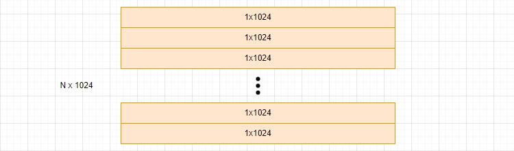

# FAISS学习

# 第三课：更少的内存

---

## Product Quantization(PQ)算法

详细代码见：课外拓展：Product Quantization.ipynb

---

**介绍：**

在使用FAISS数据库的过程中，都需要先将数据加载进入内存（RAM），再进行搜索，这就导致：如果消耗内存过大，硬件无法支持怎么办？让我们思考一下为什么会消耗太多的内存，在暴力搜索(FLat)中，高精度的数据都是直接存储进入内存中的，当然是内存开销的一大“杀手”；在IVF算法中，尽管我们设计了倒排表来增加搜索效率，但是数据也还是以原始的形式进入内存的呀，所以也是造成内存开销的罪魁祸首。那么，有没有一种办法可以对高精度的原始数据进行加密或改装，使得高精度数据可以在尽可能少得消耗准确性的情况下减少内存？这就是PQ（产品量化）算法要达成的目标

---

### 数据存储

**实现过程：**

假设我们有N个1024维的数据，每个数据又是包含很多小数点的，这些数据直接存入必然导致内存的开销过大

首先，我们先对原始数据进行切割，将其划分为一个一个向量子空间(subvectors)；越多的子空间意味着结果”越准确“但是内存开销和训练时间也相应增加；在这里，让我们假设我们一个子向量空间包含了128维，即1024=8 x 128

**关键点：**之后，我们在一个向量子空间内部，我们进行基于k-means的聚类算法，进行”码本“的构建，这里的码本的主体是计算好的”聚类中心“，对应的数据是索引值（从0到N-1）。聚类的质心数量越多，误差就越小。

最后，我们将向量子空间中的向量数据依据聚类中心进行归类，然后一类中的向量统一依据码本由聚类中心对应的索引值表示，这样就从一个128维的数据转化为了1维的数据，大大减少了内存的消耗。

其余的向量子空间都是按照一样的操作流程，最终将全部的数据按照码本编码后完成存储；这时，原(N x 1024)转化为(N x 8) 第一个8是向量子空间的数量

### 数据搜索

**实现过程：**

假如现在传入一个(1, 1024)维的数据进行相似度搜索，首先我们需要将这个1024维的向量先按照设定的子向量空间数量进行切割，然后对于每一个子向量空间，找到对应的码本进行编码；最后将编码后的数据进行相似度分析。

### 数据解码

---

获得了编码后的数据，如果需要对数据进行`decode` 函数解码，在每个向量子空间中都计算出索引对应的聚类中心，最后将不同向量子空间内的聚类中心进行拼接，就完成了还原。由于码本中储存的仅仅是聚类中心的详细值，所以解码必然会导致误差的产生。

### 误差减少

---

### IndexIVFPQ算法思维导图

---

