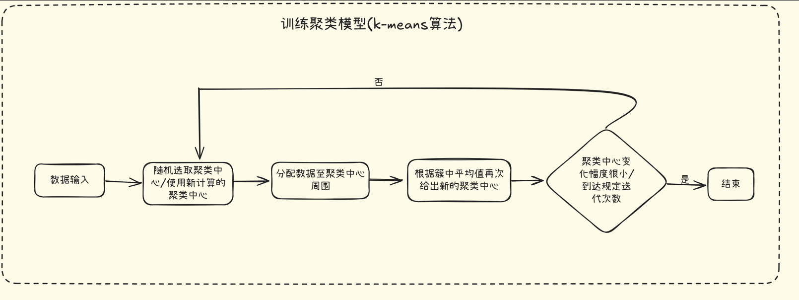
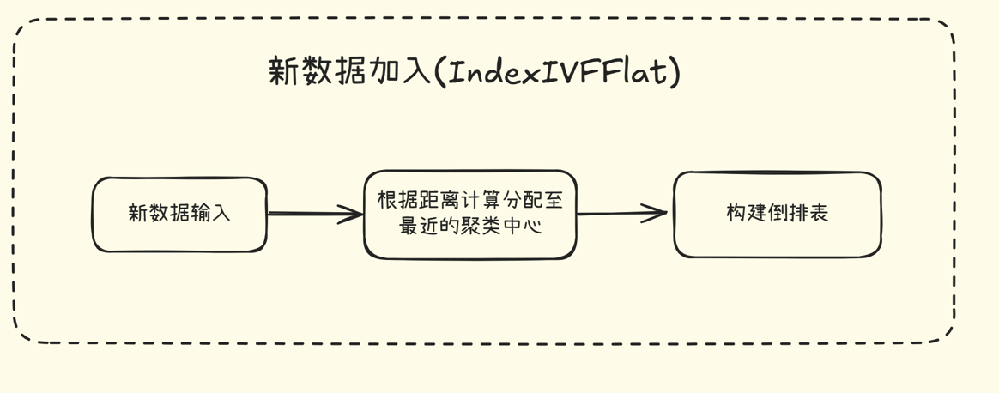
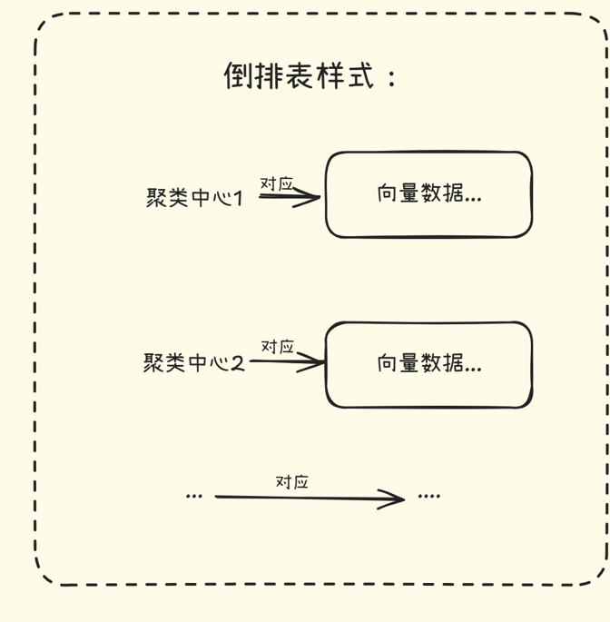
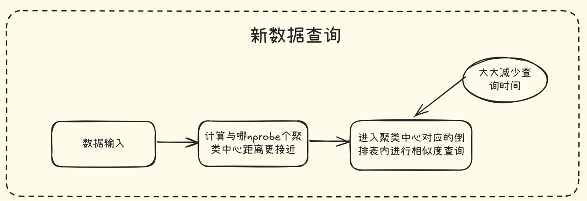

# 第二课：更快的索引

---

## 基于k-means的聚类算法

---

**算法图解：**

**算法目的：**

将大量数据按照给定数量的聚类中心(nlist)，进行分类，基本流程如下：

1. 从给定向量数据中随机选取聚类中心
2. 逐个遍历给定规定向量数据，找到距离最近的聚类中心进行分配
3. 计算每个聚类中心向量数据的平均值，构造新的向量中心
4. 循环2、3过程，直到聚类中心变化很小或者达到规定的循环次数

## 构建倒排表（IVF）

---

**算法图解：**

**算法流程：**

1. 遍历给定的全部数据，计算向量数据与各个聚类中心的距离，找到最近的聚类中心并进入对应的倒排表中
2. 直到每个数据都进行一遍这个过程，我们就得到了一副完整的倒排表

## 数据查询

---

**算法图解：**

**算法流程：**

1. 对于需要进行查询的向量数据，我们先计算和哪一个聚类中心更近
2. 再在这个聚类中心对应的倒排表中进行数据查询